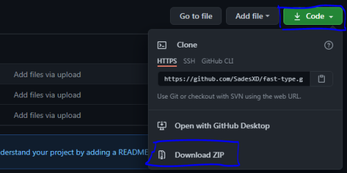

# Discord Rpc App

## Package Required
- [discord-rpc](https://www.npmjs.com/package/discord-rpc) **-> [ npm i discord-rpc ]**

## Basic Usage
1. install node.js first, Docs [https://nodejs.org/en/download/](https://nodejs.org/en/download/) and then run the setup of node.js

2. You also can install this project, switch `code` -> `download zip` 

    

3. Install the package required, ( **Quick Usage** ) Click the file called `install.bat` for install the package required

4. Setup your presence status in file called `config.json` 
- First get your <b>Client ID</b>, in [Discord Developer Portal]() and then Switch `Application` -> `New Application`-> `Set Your Application Name ( This Name[ Application name ] will auto seted in your status name )` -> Click/Copy `client ID` and paste in `config.json` -> `Client_ID`

    

- Setup all status whatever you want :)

5. If you done, click file called `start.bat` for start the status

    **Note: You need to open your discord first for use this program**

## Status Name
- large_image_text: Some text in the large image status
- small_image_text: Some text in the small image status

## Preview

